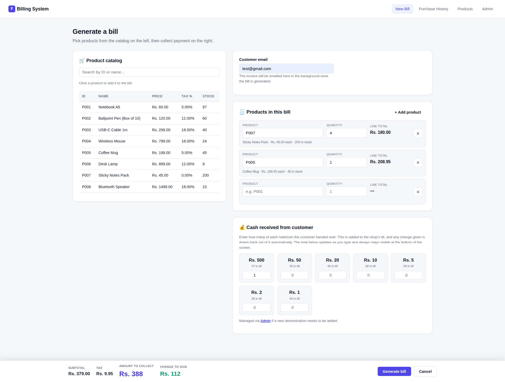
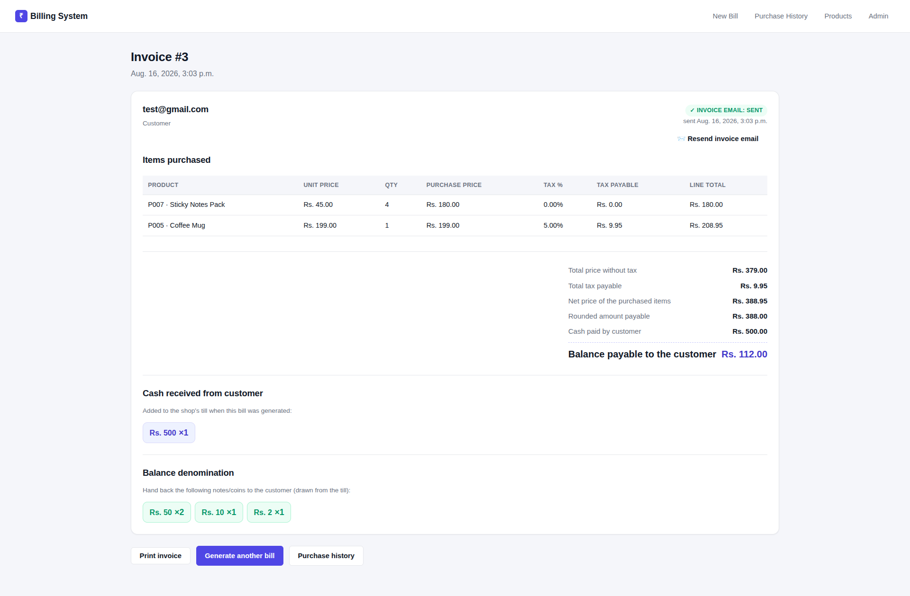
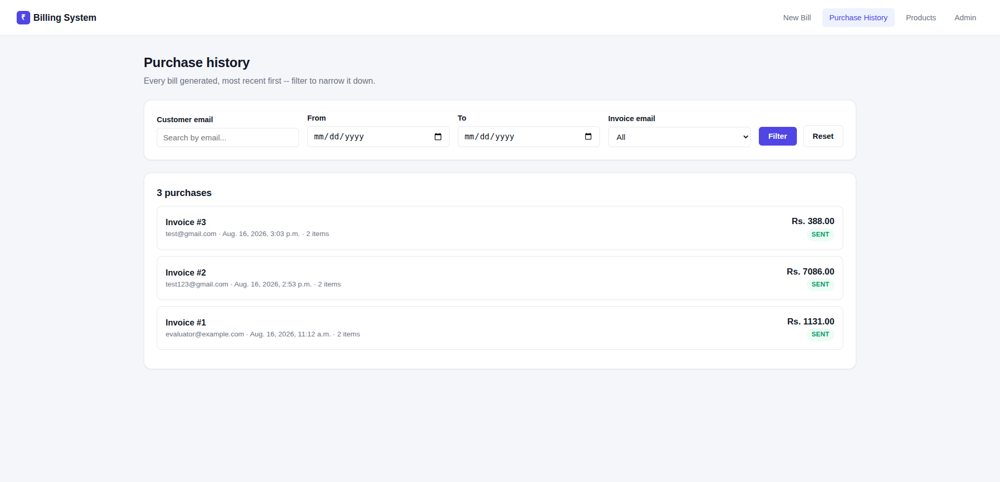
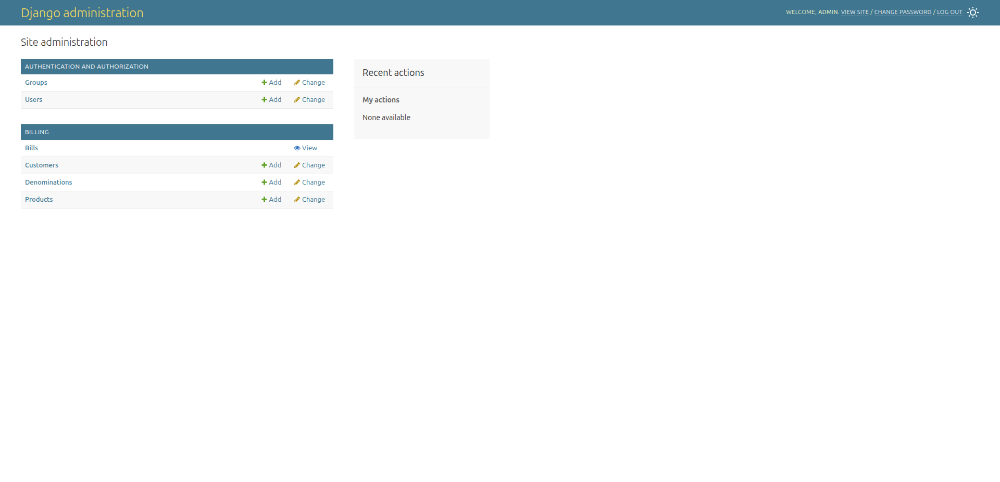
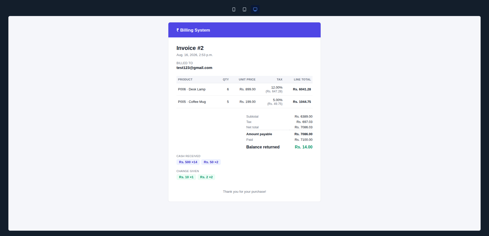
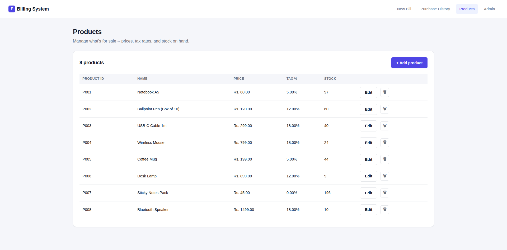

# Billing System

A Django billing application: generate a customer bill from a dynamic set of
products, calculate tax/totals, work out the exact change to return from the
shop's limited note/coin inventory (while keeping that inventory accurate as
cash moves in and out of the till), email the invoice to the customer in the
background, and look up a customer's previous purchases.

## 1. Overview

The app implements the assignment's three pages, plus in-app product
management:

- **Page 1** (`/billing/`) — pick products from a searchable, click-to-add
  catalog (or type a product ID with autocomplete), see a live running total
  as you go, enter the cash the customer physically handed over broken down
  by denomination, and submit to generate the bill. A bar fixed to the bottom
  of the screen always shows the subtotal/tax/amount due/change, so the
  cashier never has to scroll to see what to collect.
- **Page 2** (`/billing/<id>/`) — the generated bill: per-item price/tax/total,
  bill-level subtotal/tax/net/rounded/balance, the cash received and the
  change denomination breakdown, and delivery status for the invoice email
  (with a one-click **resend** if it failed or the customer asks for another
  copy).
- **Purchase history** (`/customers/history/`) — every bill, most recent
  first, filterable by customer email (partial match), date range, and
  invoice-email status; select one to see exactly what was purchased (reuses
  Page 2's template).
- **Products** (`/products/`) — add/edit/delete products from within the app
  itself (not just Admin) — the assignment explicitly allows either a CRUD
  page or Admin, so both exist: this page for day-to-day use, Django Admin
  for Denomination/Customer management and as a power-user fallback.

## 2. Features

- Searchable product catalog with click-to-add, plus a text/autocomplete
  fallback, and a live, client-side order total (subtotal/tax/amount to
  collect/change) that updates on every keystroke, pinned to the bottom of
  the screen so it's always visible.
- Cash is recorded **by denomination** (how many ₹500s, ₹50s, etc. the
  customer handed over), not as a single typed total — see "Till
  reconciliation" below.
- Per-item tax calculation, correctly rounded and summed into bill totals.
- Stock validation and atomic, race-safe stock deduction.
- **Till reconciliation**: cash tendered by the customer is added to the
  shop's `Denomination` inventory, and change given is subtracted from it, in
  the same atomic transaction — so the till stays accurate over time instead
  of only ever being drawn down.
- Change calculation via a bounded dynamic-programming algorithm that respects
  the shop's actual (limited) denomination inventory — not a naive greedy pick.
- Fully atomic billing transactions: a bill, its items, its tendered cash, and
  its change denominations are created together or not at all.
- Asynchronous invoice emailing via Celery + Redis — HTML (styled like the
  web invoice) with a plain-text fallback, automatic retry with backoff, and
  delivery status (`pending` / `sent` / `failed`) tracked on the bill and
  visible in the UI/Admin, with a manual **resend** action.
- In-app product management (list/add/edit/delete) in addition to Django
  Admin; deleting a product that's already been sold is blocked with a clear
  message instead of a server error (products are `PROTECT`ed by their bill
  history).
- Customer purchase history: browse everything by default, filter by
  email/date range/email status, paginated, with drill-down into a past
  bill's items.
- PostgreSQL as the primary, documented database (one-command via Docker),
  with an automatic SQLite fallback for zero-setup evaluation.
- 63 automated tests covering models, billing math, stock, till
  reconciliation, the denomination algorithm, views, product management, and
  the async email task — passing against **both** PostgreSQL and SQLite.

## 3. Architecture

Single Django app (`billing`) with a thin view layer and a dedicated service
layer for business logic:

```
Browser
  |
Django View (billing/views.py)         -- parses request, calls the service, renders a template
  |
Form / manual row parsing (billing/forms.py)   -- scalar field validation + dynamic-row parsing
  |
Service layer (billing/services/)
  |-- billing_service.py     -- orchestrates validation, pricing, stock, till reconciliation,
  |                              change, and persistence, all inside one transaction.atomic() block
  \-- denomination_service.py -- pure function: bounded DP change-making, no DB access
  |
Django ORM / Models (billing/models.py)
  |
Database (PostgreSQL, SQLite fallback)
```

For email:

```
billing_service.create_bill() commits its transaction
  -> transaction.on_commit(...)
  -> Celery task send_invoice_email_task.delay(bill_id)   (broker: Redis)
  -> Celery worker process picks it up, sends the email (HTML + text), updates Bill.email_status
```

Views never touch models directly for anything financial — they only build
`LineItemInput` objects and a `tendered` denomination breakdown from the
request and hand them to `billing_service.create_bill()`. This keeps
`Request -> View -> Validation -> Service -> Model/DB -> Response` easy to
trace end-to-end.

## 4. Technology Stack

- **Django 5.2 (LTS)** — chosen over Flask/FastAPI per the assignment's own
  guidance: this task is dominated by models, relationships, admin, ORM, and
  server-rendered forms, which is exactly Django's strength. Pinned to the
  LTS line rather than the just-released Django 6.x for production stability
  on an already-validated codebase — see Design Decisions.
- **PostgreSQL** (via `psycopg` 3, Django's native modern driver) as the
  primary, documented database; **SQLite** as an automatic zero-setup
  fallback when `DATABASE_URL` isn't configured.
- **Celery + Redis** for genuine background/async task processing.
- Plain server-rendered Django templates + vanilla JavaScript (no frontend
  framework, per the assignment's explicit "no need for fancy CSS/Template logic").

## 5. Project Structure

```
config/                      Django project (settings, urls, celery app)
billing/
  models.py                  Product, Denomination, Customer, Bill, BillItem,
                              BillTender (cash received), BillDenomination (change given)
  services/
    billing_service.py       create_bill(): validation, pricing, stock, till reconciliation,
                              change, persistence
    denomination_service.py  compute_change(): bounded DP change-making algorithm
  forms.py                   BillingForm (email), ProductForm, dynamic row / tender parsing
  views.py                   billing_form_view, bill_detail_view, resend_invoice_email_view,
                              customer_history_view, product_list/create/edit/delete_view
  tasks.py                   send_invoice_email_task + enqueue_invoice_email (Celery)
  admin.py                   Django Admin registration
  management/commands/seed_data.py   sample products + denominations
  templates/billing/         billing_form.html, bill_detail.html, customer_history.html,
                              product_list.html, product_form.html, email/invoice.{html,txt}
  static/billing/            billing.js (dynamic rows, live totals), style.css
  tests/                     test_models, test_billing_service, test_denomination_service,
                              test_views, test_product_views, test_tasks
docker-compose.yml           one-command local PostgreSQL + Redis
requirements.txt
.env.example
screenshots/                 see "Screenshots" below
```

## 6. Setup

Requires Python 3.12+ (any recent Python 3.10+ will work) and, for the
recommended path, Docker.

### Recommended: PostgreSQL + Redis via Docker

```bash
# 1. From the project root, create and activate a virtual environment
python3 -m venv .venv
source .venv/bin/activate

# 2. Install dependencies
pip install -r requirements.txt

# 3. Configure environment variables (the defaults already point at the
#    services docker-compose starts below, so this just works)
cp .env.example .env

# 4. Start PostgreSQL + Redis
docker compose up -d

# 5. Run migrations
python manage.py migrate

# 6. Load sample data (products + denominations)
python manage.py seed_data

# 7. (Optional, for the Admin) create a superuser
python manage.py createsuperuser

# 8. Start the app
python manage.py runserver
```

Open http://127.0.0.1:8000/. Invoice emails print to the terminal running
`runserver` (console backend) unless you configure real SMTP -- see
"Email Configuration". For invoice emails to actually send in the
background rather than just being queued, also start a Celery worker in a
second terminal (same venv activated):

```bash
celery -A config worker -l info
```

### Alternative: SQLite, no Docker at all

Don't want to run Docker/Postgres? Skip step 3 (or just don't set
`DATABASE_URL`) and steps 4/8 above still work — `config/settings.py` falls
back to a local `db.sqlite3` file automatically. The core billing flow works
identically either way; Redis/Celery are still needed only for background
email delivery (see Design Decisions for what happens if they're not
running: the bill still commits, email is just queued as "pending").

## 7. Initial Data

`python manage.py seed_data` creates 8 sample products (`P001`-`P008`, varied
stock/price/tax rates) and the 7 denominations from the assignment's wireframe
(₹500, ₹50, ₹20, ₹10, ₹5, ₹2, ₹1) with starting inventory. It's idempotent
(`get_or_create`) — safe to run more than once. Products can also be added,
edited, or deleted via `/products/` or `/admin/`.

## 8. Email Configuration

Defaults to Django's **console backend** — invoice emails print to the
terminal, so there's nothing to configure to see the feature working locally.

**Quickest way to see a real email land somewhere**: a free
[Mailtrap](https://mailtrap.io) sandbox inbox — no real recipient needed, it
intercepts everything regardless of the `to` address:

```
EMAIL_BACKEND=django.core.mail.backends.smtp.EmailBackend
EMAIL_HOST=sandbox.smtp.mailtrap.io
EMAIL_PORT=587
EMAIL_HOST_USER=<your Mailtrap sandbox username>
EMAIL_HOST_PASSWORD=<your Mailtrap sandbox password>
EMAIL_USE_TLS=True
```

Or real SMTP (e.g. Gmail with an App Password):

```
EMAIL_BACKEND=django.core.mail.backends.smtp.EmailBackend
EMAIL_HOST=smtp.gmail.com
EMAIL_PORT=587
EMAIL_HOST_USER=your-address@gmail.com
EMAIL_HOST_PASSWORD=your-app-password
EMAIL_USE_TLS=True
DEFAULT_FROM_EMAIL=Billing System <billing@example.com>
```

Either way, a Celery worker must be running to actually process the email
(see Setup) — changing `EMAIL_BACKEND` alone doesn't make sending synchronous.
The email is sent as HTML (styled like the web invoice) with a plain-text
fallback attached automatically.

## 9. Testing

```bash
python manage.py test billing
```

**63 tests, 0 failures** — verified against both PostgreSQL (via
`docker compose up -d db`) and the SQLite fallback. Coverage spans models,
billing calculations (including a golden test reproducing the assignment
wireframe's floor-rounding behavior), stock handling/rollback, till
reconciliation (tendered cash increments `Denomination` inventory, change
decrements it, both roll back together on failure), the denomination
change-making algorithm (including a case constructed so a naive greedy pick
would fail but the DP succeeds), product management (including the
delete-a-sold-product-is-blocked case), views, purchase-history
filtering/pagination, and the async email task (including the resend path).
Tests run with `CELERY_TASK_ALWAYS_EAGER=True` (enabled automatically when
`manage.py test` runs), so the Celery task executes inline and email content
can be asserted via `django.core.mail.outbox` — no Redis or worker process
needed to run the suite.

## 10. Screenshots

**Demo video**: [Watch a walkthrough of the application](https://www.awesomescreenshot.com/video/55596446?key=e68af1ebbae843ec4770799d4e34dba1)

**Billing page** — searchable product catalog, dynamic product rows, cash received by denomination, live totals bar:


**Generated invoice** — items, subtotal/tax/net/rounded/paid/balance, cash received and change denomination breakdown, email delivery status:


**Purchase history** — every bill, filterable by email/date range/email status:


**Django Admin** — Products/Customers/Denominations manageable, Bills view-only by design:


**Invoice email** — HTML email styled like the web invoice, delivered via Celery + Redis:


**In-app product management** — add/edit/delete without needing Admin:


## 11. Assumptions

The PDF's Page 2 wireframe gives exact sample figures (subtotal 2102.00, tax
255.60, net 2357.60, rounded 2357.00, balance 643.00), which resolve most of
the arithmetic ambiguity directly — those figures are treated as a
specification, not a suggestion. Remaining ambiguities and the assumption made
for each:

1. **Product ID** is a dedicated business-facing field (`Product.product_id`,
   e.g. `P001`), separate from Django's internal database primary key, since
   the assignment lists "product ID" as a field alongside name/stock/price
   rather than implying it's just the DB row number. Assigned by the shop
   admin (like a SKU) when a product is created via the Products page,
   Admin, or seed data.
2. **Cash is collected as a denomination breakdown, not a single typed
   total.** The cashier enters how many of each note/coin the customer
   handed over; the paid amount is *derived* from that (`sum(value × count)`),
   never typed directly. This is what makes till reconciliation possible: the
   till's current counts are shown alongside each input for context, but the
   *submitted* counts are what get trusted and written — the database (with
   rows locked inside the transaction) remains the final authority on the
   resulting inventory.
3. **Tax is computed per line item, then summed** into the bill's tax total
   (not computed once on the aggregate subtotal) — this is what the wireframe's
   worked example implies, and it's also the only approach that supports
   per-product tax rates correctly.
4. **Tax is rounded to the nearest paisa per line item** (not just once at the
   end), so the "Tax payable for item" figures shown on the invoice always sum
   exactly to the bill's tax total — a small but real correctness property an
   evaluator can verify by hand-adding the rows.
5. **The final payable amount is floored to the nearest whole rupee** (e.g.
   2357.60 -> 2357.00) since the shop's denominations are all whole-rupee
   notes/coins and change can only be made in whole rupees; the fractional
   remainder is waived in the customer's favor. This exactly reproduces the
   wireframe's own example.
6. **Paid amount is always a whole rupee value** — structurally guaranteed
   rather than separately validated, since it's built entirely from whole-rupee
   denomination values times integer counts.
7. **Duplicate product IDs within one bill submission are rejected**, asking
   the cashier to combine the quantity into a single row, rather than silently
   merging them.
8. **Full payment is required at billing time** — paid amount must cover the
   full rounded total; there's no partial-payment/credit concept, which the
   assignment doesn't mention.
9. **Impossible exact change hard-fails the whole bill** (rolled back, nothing
   persisted) rather than dispensing approximate change or leaving a debt —
   the cashier can then ask for a different payment amount.
10. **No authentication** on the billing/history/product pages — out of scope
    per the assignment, which focuses on Model/View correctness. Django
    Admin (already auth-protected) remains available for the same data.

## 12. Design Decisions

- **`Decimal` everywhere for money.** Never `float`, despite the assignment
  describing price/tax as "float" conceptually — floats cannot represent
  currency exactly and would eventually produce off-by-a-paisa bugs.
- **Bounded DP for change-making, not greedy.** With a *limited* note supply,
  a one-pass greedy algorithm is not provably correct: it can commit to a
  large denomination that strands the remainder with no valid completion, even
  though skipping it in favor of smaller notes would reach the exact target
  (worked example and test in `denomination_service.py` /
  `test_denomination_service.py`). The DP explores every achievable sum, so
  it's correct by construction, and also minimizes the number of notes
  returned.
- **One `transaction.atomic()` per bill**, with `select_for_update()` on the
  specific `Product` and `Denomination` rows involved (locked in a
  deterministic, sorted order to avoid deadlocking against concurrent billing
  requests). Stock and denomination inventory are only touched after every
  validation has passed, so a failure anywhere leaves the database exactly as
  it was — no partial bill, no partial stock/inventory update.
- **Till reconciliation happens in one transaction, in a specific order.**
  Tendered cash is added to `Denomination.available_count` *before* change is
  computed, so change is correctly drawn from a till that already includes
  what the customer just paid with (exactly like a real cash drawer). Both the
  increment (`BillTender`) and the decrement (`BillDenomination`) live in the
  same `transaction.atomic()` block as the bill itself, so an
  impossible-change failure rolls back the tender too.
- **Historical price/tax snapshots on `BillItem`.** `unit_price` and
  `tax_percent` are copied onto the bill item at sale time, so a later change
  to `Product.price`/`tax_percent` never rewrites a past invoice.
- **Bills are read-only in Admin.** A `Bill` is a financial record produced
  only by `billing_service.create_bill()`; hand-editing one in Admin could
  desync it from stock/denomination inventory that has already moved, so
  add/change/delete permissions are disabled for `Bill` — it's viewable and
  searchable only.
- **PostgreSQL primary, SQLite fallback, both driven by one `DATABASE_URL`
  setting.** `settings.py` reads `DATABASE_URL` via `dj-database-url` and
  falls back to a local SQLite file when it's unset — no separate code paths
  or config branches to maintain, just one env var that changes the target.
  Postgres is what's documented and tested as primary; SQLite stays as a
  genuine zero-Docker fallback rather than being dropped, since it costs
  nothing to keep and directly serves "must run on the evaluator's machine
  without issues."
- **Dependencies pinned to already-validated current versions, not blindly
  bumped to the newest majors.** At the time of this pass, newer majors were
  available (Django 6.1, redis-py 8.x, dj-database-url 3.x) but weren't
  adopted here: Django is pinned to the 5.2 **LTS** line specifically (long
  support window, the standard "stability first" choice for a real backend),
  and jumping any of these across a major version this late — on a codebase
  with 63 already-passing tests covering real business logic — trades a
  version-number bump for unreviewed breaking-change risk with no benefit to
  the assignment itself. All pins were freshly resolved (not copied from
  memory/tutorials), and the full suite passes against both PostgreSQL and
  SQLite on exactly these versions.
- **Celery + Redis over a DB-broker alternative** (e.g. Django-Q2/Huey) for
  the async email — it's the more widely recognized, genuinely production-grade
  choice. The setup-friction tradeoff is mitigated two ways: `docker-compose.yml`
  gets Postgres + Redis running in one command, and the billing transaction is
  resilient to the broker being unavailable — enqueueing the task is wrapped
  so a connection failure only logs a warning; **the bill itself is never
  rolled back because of an email/infra problem**.
- **HTML invoice email, separate from the web page's CSS.** The web UI's
  stylesheet leans on flexbox/grid/CSS variables, none of which are reliable
  in email clients (Outlook desktop renders HTML email through Word's engine,
  not a browser). `billing/templates/billing/email/invoice.html` is a
  self-contained, table-based, inline-styled document instead — the standard
  approach for transactional email — sent alongside the plain-text version via
  `EmailMultiAlternatives` so clients that don't render HTML still get a
  readable fallback.
- **No Django REST Framework / API layer.** The assignment asks for
  server-rendered pages, not an API; adding DRF would be unused surface area.
- **Dynamic rows via `getlist()`, not a Django formset.** The "Add New" button
  clones a plain `<template>` row with no formset management-form bookkeeping
  to keep in sync in JS; the view reads `product_id`/`quantity` as repeated
  fields via `request.POST.getlist()`. Server-side validation (product
  existence, quantity, stock, duplicates) is authoritative regardless of what
  the client sends.
- **Product deletion is guarded, not just attempted.** `BillItem.product` is
  `on_delete=PROTECT`; the delete view catches `ProtectedError` and shows a
  clear message ("already sold in one or more bills, set stock to 0 instead")
  rather than letting a raw 500 through — a product with sales history must
  stay around so past invoices keep making sense.

## 13. Known Limitations

- No authentication/authorization on the billing/history/product pages (see
  Assumption 10) — anyone who can reach the app can generate bills or edit
  products. Fine for this assignment's scope; a real deployment would add
  `@login_required` and role-based access for cashiers vs. admins.
- Concurrency correctness (`select_for_update()` row locking) is implemented
  and reasoned about carefully and is exercised against real Postgres in
  testing, but the automated tests verify atomicity/rollback behavior
  directly rather than via genuinely concurrent simultaneous requests.
- The denomination DP is a straightforward bounded-knapsack implementation
  (not the binary-decomposition-optimized version); it's easily fast enough
  for realistic shop-till amounts and note counts, but wouldn't be the right
  choice unmodified for adversarially large inputs.
